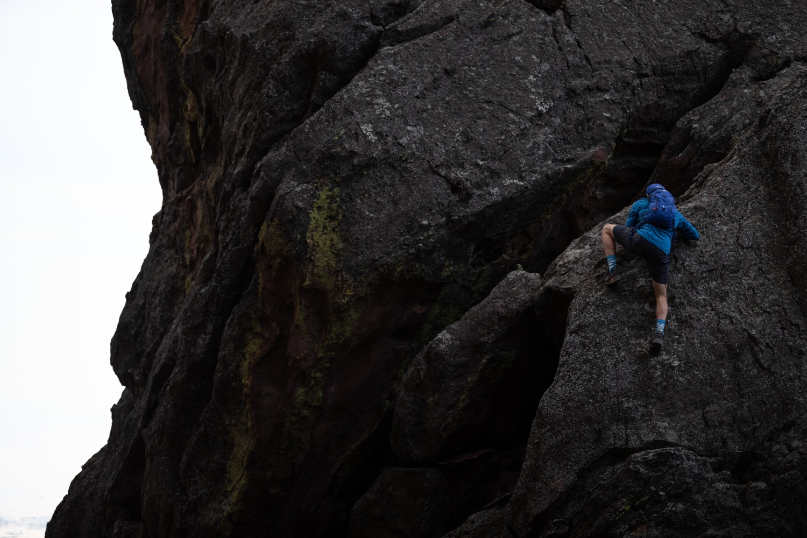

## Hello, I am Jonny Morsicato 👋

#### About Me

After graduating Colorado School of Mines I started work as a freelance worker part time while running a small media colective I Co-Founded, [The Coyote Collective](https://www.thecoyotecollective.com). Every moment of free time I get I am working to refine my data science skills and learn more about how I can better understand the world through the massive amount of available data on the internet. I want to combine the modern skills of Machine Learning/AI, programming, scraping, munging, and visualization with the ancient art of story telling. My dream is to help bridge the gap between science and the everyday person.

### Current Skills 

- Python, Java, Javascript
- Jupyter Notebooks 
- R Studio 
- Storytelling 
- Curiosity 
- Data Visualization (Plotly, Mathplotlip, ggplot, seaborn)

### Contact Me

- 🌏 Location: Denver, Colorado
- ✉️ Email: Jamorsicato@gmail.com

### Favorite Poem

There's a race of men that don't fit in,
A race that can't stay still;
So they break the hearts of kith and kin,
And they roam the world at will.
They range the field and they rove the flood,
And they climb the mountain's crest;
Theirs is the curse of the gypsy blood,
And they don't know how to rest.

<!--
**jamorsicato/jamorsicato** is a ✨ _special_ ✨ repository because its `README.md` (this file) appears on your GitHub profile.

Here are some ideas to get you started:

- 🔭 I’m currently working on ...
- 🌱 I’m currently learning ...
- 👯 I’m looking to collaborate on ...
- 🤔 I’m looking for help with ...
- 💬 Ask me about ...
- 📫 How to reach me: ...
- 😄 Pronouns: ...
- ⚡ Fun fact: ...
-->
